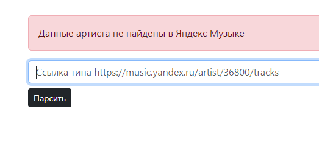
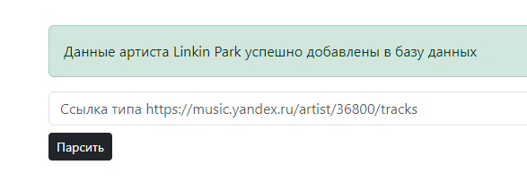

# YandexMusicParser

>Тестовое задание на позицию PHP-разработчика для NewGen Vision

## Файлы, требуемые по заданию:

* /Db.sql - SQL - запросы для создания всех необходимых таблиц;
* /app/Http/Controllers/Example.php - пример использования;
* /app/Parsers/YandexMusicParser.php - класс для парсинга Yandex music;
* /README.md - этот файл с описанием проекта

## Используемые технологии

* [Laravel 10](https://laravel.com/docs/10.x)
* [Composer](https://getcomposer.org/)
* [PHP 8](https://www.php.net/)
* [MySQL](https://www.mysql.com/)
* [ext-curl](https://curl.se/)
* [paquettg/php-html-parser](https://github.com/paquettg/php-html-parser)
* [Bootstrap 5](https://getbootstrap.com/docs/5.3/getting-started/introduction/)

### Как работает класс YandexMusicParser
1. Получает ссылку при инициализации экземпляра класса.
2. Получает html страницу по сслыке при помощи curl.
3. Парсит страницу при помощи paquettg/php-html-parser.
4. Записывает полученные данные в базу данных (данные не дублируются).

### Как запустить проект (если понадобится)

После клонирования репозитория необходимо выполнить следующие шаги:
1. Выполнить SQL скрипт из файла Db.sql для создания необходимых таблиц.
2. Настроить в .env подключение к базе данных (Db.sql создает таблицу yandex-parser, так что лучше указать её или исправить файл Db.sql по желанию).
3. Выполнить установку зависимостей:
```
composer install
```
4. Поднять локальный сервер:
```
php artisan serve
```

После выполнение вышеперечисленных шагов на localhost:8000 появится страница с формой - пример использования парсера.

>Пример:



